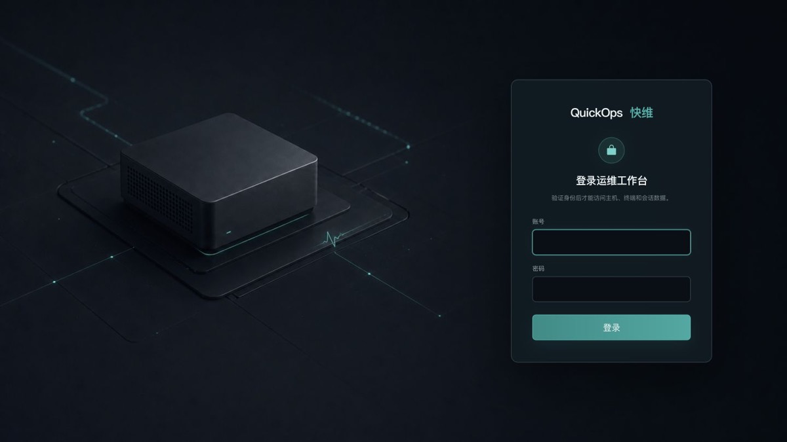

<div align="center">

# QuickOps 快维

**面向单机与内网场景的开源 AI 运维助手**<br>
**An open-source AI operations assistant for single-node and intranet environments**

[简体中文](#简体中文) · [English](#english) · [下载 v0.0.1](https://github.com/bobo-study/QuickOps/releases/tag/v0.0.1) · [安全策略](SECURITY.md)

[](https://github.com/bobo-study/QuickOps/actions/workflows/ci.yml)
[](https://github.com/bobo-study/QuickOps/releases/latest)
[](LICENSE)

</div>



## 简体中文

QuickOps 快维是一个基于 [Agno](https://www.agno.com/) 构建的 AI 运维工具。它把 AI 会话、持久终端、主机状态、四级权限、HITL 审批、命令审计和可选工具箱放进同一个工作台，目标是让运维人员在不牺牲控制权的前提下，更高效地诊断和操作服务器。

> 当前版本：**v0.0.1（早期预览）**。请先在测试机或受控环境中评估。涉及生产系统的操作必须由具备相应权限的人员确认。

### 主要能力

- **小维 AI 运维助手**：理解当前绑定主机、终端路径和会话上下文。
- **AI 与手动终端统一体验**：每个会话拥有独立、持久的目标 Shell，AI 和用户共享 cwd、环境变量与进程状态。
- **四级权限控制**：只读模式、审批执行、替我审批、完全访问。
- **Agno HITL 审批**：变更操作在服务端分类，并在需要时请求明确授权。
- **真实主机信息**：跨平台读取 macOS、Linux 与 Windows 的主机和运行指标。
- **流式运行事件**：文本、思考状态、工具调用和审批结果按真实顺序呈现。
- **可选 Agno 工具箱**：编码、Docker、文件、Python、网页搜索和数据库工具按需启用。
- **本地优先与离线部署**：SQLite 持久化；Linux x86_64 一键离线安装包不依赖目标服务器联网。
- **中英双语界面**：可在设置中即时切换并持久保存。

### 一键安装（Linux x86_64）

联网服务器可从 GitHub Release 下载。安装程序会交互式询问运行账户、网页登录凭据和 HTTP 端口：

```bash
curl -fL -o quickops.run \
  https://github.com/bobo-study/QuickOps/releases/download/v0.0.1/quickops-linux-x86_64-offline-v0.0.1.run
curl -fL -o quickops.run.sha256 \
  https://github.com/bobo-study/QuickOps/releases/download/v0.0.1/quickops-linux-x86_64-offline-v0.0.1.run.sha256
sha256sum -c quickops.run.sha256
chmod +x quickops.run
sudo ./quickops.run
```

升级时下载新版本安装包并再次执行即可。安装器会备份 SQLite 数据并保留模型配置与服务端密钥。请在执行下载安装或升级前由用户明确确认。

完全离线的服务器可在其他设备下载同一个 `.run` 文件和校验文件，再通过受控介质传入目标服务器。

### 本地开发

要求：Node.js 20+、Python 3.12+、[uv](https://docs.astral.sh/uv/)。

```bash
npm ci
uv sync --dev
cp .env.example .env
npm run dev:api
```

另开终端启动前端：

```bash
npm run dev -- --host 127.0.0.1 --port 4174
```

验证：

```bash
npm run build
npm run test:sites
npm run test:backend
npm run lint:backend
```

不要提交 `.env`、数据库、日志、模型密钥或真实部署凭据。公开报告安全问题前请阅读 [SECURITY.md](SECURITY.md)。

### 项目状态与路线

- v0.0.1 聚焦单用户、单节点、本地或内网部署。
- 后续将继续完善远程主机适配、可观测性、工具生态、安装升级体验和安全边界。
- API 与数据库结构在 `0.x` 阶段可能演进；升级包会尽量保持数据兼容并在必要时提供迁移说明。

## English

QuickOps is an open-source, [Agno](https://www.agno.com/)-powered AI operations assistant for single-node and intranet environments. It combines AI conversations, a persistent terminal, live host telemetry, four permission levels, human-in-the-loop approvals, command auditing, and optional toolkits in one workspace.

> Current release: **v0.0.1 (early preview)**. Evaluate it on a test machine or in a controlled environment first. Production operations must be reviewed by an authorized operator.

### Highlights

- **Xiaowei, the operations copilot** understands the bound host, terminal working directory, and session context.
- **Unified AI and manual terminal** with one persistent target shell per conversation.
- **Four permission levels**: read only, approval required, risk-based approval, and full access.
- **Agno HITL approvals** backed by server-side, impact-based command classification.
- **Real cross-platform host data** for macOS, Linux, and Windows.
- **Ordered streaming events** for text, reasoning state, tools, and approval outcomes.
- **Optional Agno toolkits** for coding, Docker, files, Python, web search, and databases.
- **Local-first, offline-ready deployment** with SQLite and a self-contained Linux x86_64 installer.
- **Chinese and English UI** with immediate switching and server-side persistence.

### Quick install (Linux x86_64)

```bash
curl -fL -o quickops.run \
  https://github.com/bobo-study/QuickOps/releases/download/v0.0.1/quickops-linux-x86_64-offline-v0.0.1.run
curl -fL -o quickops.run.sha256 \
  https://github.com/bobo-study/QuickOps/releases/download/v0.0.1/quickops-linux-x86_64-offline-v0.0.1.run.sha256
sha256sum -c quickops.run.sha256
chmod +x quickops.run
sudo ./quickops.run
```

The installer asks only for an existing non-root OS account, web login credentials, and an HTTP port. Running a newer installer performs an in-place upgrade with a SQLite backup. Air-gapped servers can receive the same installer and checksum through controlled media.

### Development

Requirements: Node.js 20+, Python 3.12+, and [uv](https://docs.astral.sh/uv/).

```bash
npm ci
uv sync --dev
cp .env.example .env
npm run dev:api
# In another terminal:
npm run dev -- --host 127.0.0.1 --port 4174
```

See [CONTRIBUTING.md](CONTRIBUTING.md) for the development workflow and [SECURITY.md](SECURITY.md) for responsible disclosure.

## Architecture

```text
React UI
  └─ QuickOps API + SQLite
      └─ Agno AgentOS / Agent / HITL / sessions
          └─ QuickOps policy + shared persistent Shell
              └─ Real macOS / Linux / Windows host
```

More details: [docs/architecture.md](docs/architecture.md).

## Author and license

Created and maintained by **动感光波 ([@bobo-study](https://github.com/bobo-study))**.

Licensed under the [Apache License 2.0](LICENSE). By contributing, you agree that your contributions are provided under the same license.

---

Keywords: AI 运维, AIOps, AI operations assistant, Agno AgentOS, HITL approval, server management, terminal copilot, infrastructure diagnostics, offline deployment, intranet DevOps.
